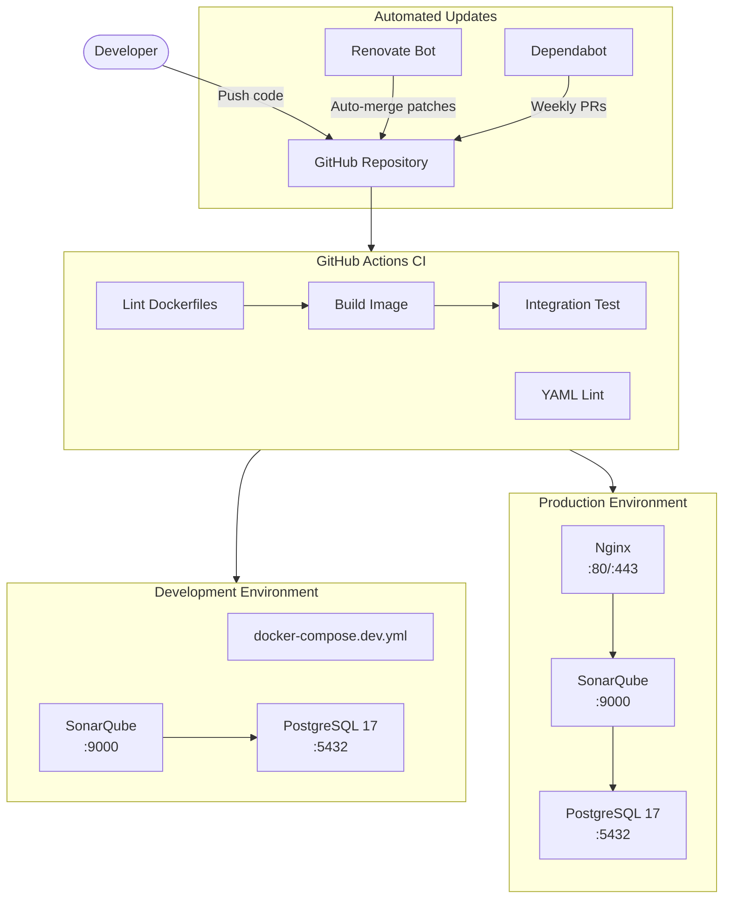
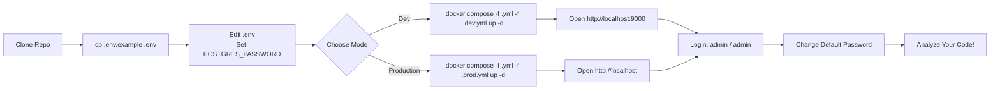

# SonarQube Docker Deployment

Production-grade SonarQube Community Build setup with Docker Compose, multi-environment support, and automated dependency management.

**Version:** SonarQube Community Build 26.5.0 (latest) · PostgreSQL 17 Alpine

## Architecture Flow



## Features

- **Multi-environment** — dev and production configurations via compose overrides
- **PostgreSQL 17** — dedicated database with health checks and persistence
- **Nginx reverse proxy** (prod) — TLS termination, security headers
- **GitHub Actions CI** — lint, build, integration test, YAML validation
- **Renovate** — automated dependency updates with auto-merge for patches
- **Dependabot** — fallback dependency monitoring

## Supported Languages

SonarQube Community Build supports the following out of the box:

| Language | Support |
|----------|---------|
| Java | Built-in |
| Kotlin | Built-in |
| Python | Built-in |
| Go | Built-in |
| SQL | Built-in |
| Shell | Built-in |
| YAML / YML | Built-in |
| JSON | Built-in |
| JavaScript / TypeScript | Built-in |
| C# | Built-in |
| HTML / CSS / XML | Built-in |
| Terraform | Built-in |
| Dockerfile | Built-in |
| Kubernetes | Built-in |
| CloudFormation | Built-in |

## Prerequisites

- **Docker** 24+ and **Docker Compose v2** ([install guide](https://docs.docker.com/engine/install/))
- **At least 4GB RAM** allocated to Docker (6GB+ recommended)
- For production: a domain name with DNS pointing to your server

## Setup Workflow



## Quick Start

```bash
# 1. Clone the repo
git clone git@github.com:vanchasrujankumar/sonarqube-docker-deployment.git
cd sonarqube-docker-deployment

# 2. Create .env from template (NO real passwords in git)
cp .env.example .env

# 3. Edit .env — set a strong password
#    Password is ONLY stored locally in .env (already in .gitignore)
#    NEVER commit .env to git
vim .env
# → Change: POSTGRES_PASSWORD=your_strong_password_here

# 4. Start in development mode
docker compose -f docker-compose.yml -f docker-compose.dev.yml up -d

# 5. Wait for startup (first run takes 2-3 minutes)
docker compose logs -f sonarqube
# Wait until you see "SonarQube is operational"

# 6. Open in browser
open http://localhost:9000
# Login: admin / admin
# CHANGE THE DEFAULT PASSWORD IMMEDIATELY
```

## Usage

### Development Mode

```bash
# Start
docker compose -f docker-compose.yml -f docker-compose.dev.yml up -d

# Watch logs
docker compose logs -f

# Check health
curl http://localhost:9000/api/system/status

# Stop (preserves data volumes)
docker compose -f docker-compose.yml -f docker-compose.dev.yml down

# Full reset (destroys all data)
docker compose -f docker-compose.yml -f docker-compose.dev.yml down -v
```

### Production Mode

```bash
# Start with nginx reverse proxy
docker compose -f docker-compose.yml -f docker-compose.prod.yml up -d

# Run health check script
./scripts/healthcheck.sh

# Check logs
docker compose -f docker-compose.yml -f docker-compose.prod.yml logs -f nginx

# Stop
docker compose -f docker-compose.yml -f docker-compose.prod.yml down
```

### Using the Init Script

```bash
# Dev mode
ENV_MODE=dev ./scripts/init.sh

# Production mode
ENV_MODE=production ./scripts/init.sh
```

## Local Test (Before Pushing to GitHub)

```bash
# 1. Copy and configure environment
cp .env.example .env
# Edit .env → set POSTGRES_PASSWORD

# 2. Start the stack
docker compose -f docker-compose.yml -f docker-compose.dev.yml up -d --wait

# 3. Verify it's running
curl http://localhost:9000/api/system/status
# Expected: {"status":"UP"}

# 4. Login check
curl -u admin:admin http://localhost:9000/api/authentication/validate
# Expected: {"valid":true}

# 5. Clean up
docker compose -f docker-compose.yml -f docker-compose.dev.yml down -v
rm .env
```

## Security: No Secrets in Git

| File | Contains secrets? | Tracked in git? |
|------|-------------------|----------------|
| `.env.example` | **Placeholder only** (`change_this_strong_password`) | ✅ Yes |
| `.env` | Real passwords | ❌ No (in `.gitignore`) |
| `nginx/ssl/` | TLS certificates | ❌ No (in `.gitignore`) |
| `nginx/htpasswd` | Auth credentials | ❌ No (in `.gitignore`) |

**Rule:** Always edit `.env.example` with placeholders only. Never commit real credentials.

## Project Structure

```
├── docker-compose.yml          # Base — SonarQube + PostgreSQL
├── docker-compose.dev.yml      # Dev overrides (debug, lower resources)
├── docker-compose.prod.yml     # Prod overrides (nginx, higher resources)
├── Dockerfile.sonarqube        # Custom image (curl, jq, healthcheck)
├── .env.example                # Template — edit and save as .env
├── .gitignore                  # .env, ssl certs, IDE files excluded
├── config/
│   └── sonar.properties        # SonarQube configuration
├── nginx/
│   └── nginx.conf              # Reverse proxy (TLS-ready)
├── scripts/
│   ├── init.sh                 # One-command startup helper
│   └── healthcheck.sh          # Health & plugin status reporter
├── plugins/                    # Drop-in .jar files (optional)
└── .github/
    ├── renovate.json5          # Auto-merge patches, group updates
    ├── dependabot.yml          # Weekly fallback checks
    └── workflows/
        └── ci.yml              # Lint → Build → Test → YAML lint
```

## Automations

### Renovate (Primary — auto-merge)

- **Patch updates** → auto-merged immediately
- **Minor Docker updates** → auto-merged weekly
- **Major updates** → requires manual approval
- Groups: Docker Compose, GitHub Actions, PostgreSQL, SonarQube, Nginx

### Dependabot (Fallback)

- Weekly checks on Docker images and GitHub Actions
- Creates PRs (no auto-merge)

### GitHub Actions CI

On every push/PR to `main`:
1. **hadolint** — lints Dockerfile
2. **Compose validation** — validates all compose files
3. **Docker build** — builds custom image with cache
4. **Integration test** — starts the full stack, waits for health, verifies `UP`
5. **yamllint** — validates all YAML files

## Environment Variables

| Variable | Required | Default | Description |
|----------|----------|---------|-------------|
| `ENV_MODE` | No | `dev` | `dev` or `production` |
| `POSTGRES_PASSWORD` | **Yes** | — | Database password (set in `.env`) |
| `SONAR_VERSION` | No | `community` | Docker image tag |
| `SONAR_HTTP_PORT` | No | `9000` | SonarQube web port |
| `POSTGRES_TAG` | No | `17-alpine` | PostgreSQL version |
| `POSTGRES_DB` | No | `sonarqube` | Database name |
| `POSTGRES_USER` | No | `sonarqube` | Database user |
| `TZ` | No | `UTC` | Timezone |

## Production SSL Setup

```bash
# 1. Place SSL certificate and key
mkdir -p nginx/ssl
cp /path/to/fullchain.pem nginx/ssl/
cp /path/to/privkey.pem nginx/ssl/

# 2. Uncomment the HTTPS server block in nginx/nginx.conf
#    Search for "# HTTPS server" and remove leading #

# 3. Update server_name in nginx.conf to your domain

# 4. Start in production mode
docker compose -f docker-compose.yml -f docker-compose.prod.yml up -d
```

## Adding Custom Plugins

Place `.jar` files in the `plugins/` directory:

```bash
# Example: SonarHTML plugin
wget -P plugins/ https://github.com/SonarSource/sonar-html/releases/download/.../sonar-html-plugin.jar

# Restart SonarQube
docker compose restart sonarqube
```

## Troubleshooting

```bash
# View all logs
docker compose logs -f

# Check SonarQube status
curl http://localhost:9000/api/system/status

# Check if DB is connected
docker compose exec postgres pg_isready -U sonarqube

# Increase Docker memory (macOS)
# Docker Desktop → Settings → Resources → Advanced → 6GB+

# Reset everything
docker compose down -v
```

## Upgrading

Renovate automatically creates PRs for new SonarQube and PostgreSQL versions. For major upgrades:

1. Review the Renovate PR
2. Test locally: `docker compose up -d --wait`
3. Check health: `curl http://localhost:9000/api/system/status`
4. Merge and deploy
